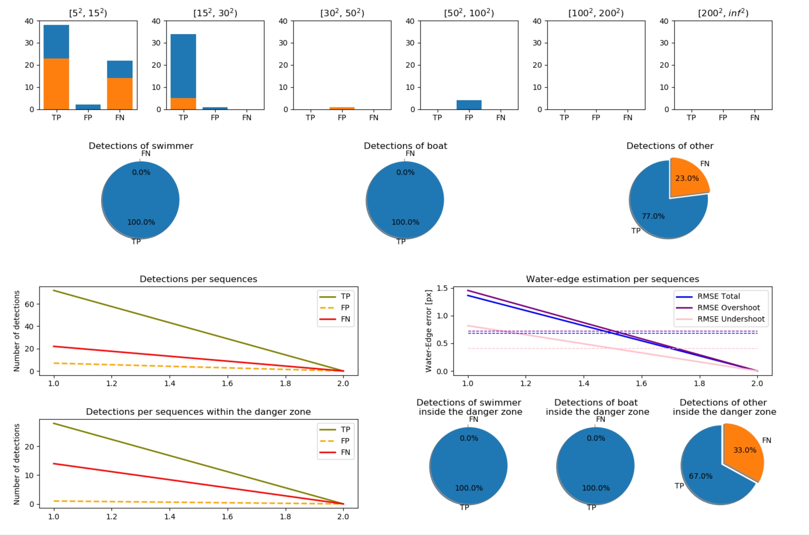
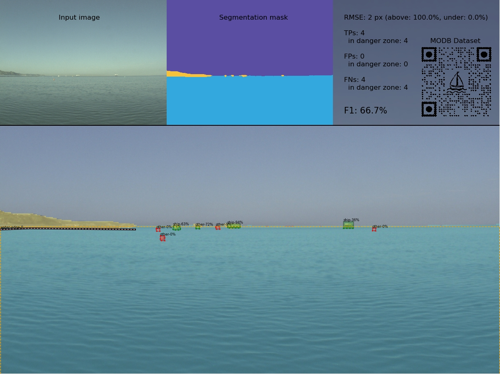

# Marine Obstacle Detection Benchmark
[1] Bovcon Borja, Muhovič Jon, Vranac Duško, Mozetič Dean, Perš Janez and Kristan Matej,<br>
<i>"MODS -- A USV-oriented object detection and obstacle segmentation benchmark"</i><br>
Published in: IEEE Transactions on Intelligent Transportation Systems, 2021<br>

<a href="https://arxiv.org/abs/2105.02359">Read paper on arXiv</a><br>

Download full dataset from <a href="https://vision.fe.uni-lj.si/public/modd3/">here</a>.

Updates:<br>
* [October 2021] Released <i>Marine Obstacle Segmentation Benchmark</i> evaluation scripts and dataset


## 1. Installation
### Requirements
To successfully run the provided benchmark scripts you will need the following packages:
* <a href="https://www.python.org/">Python</a> >= 3.6
* <a href="https://opencv.org/">OpenCV</a> >= 3.4
* <a href="https://ffmpeg.org/">FFMPEG</a>
* <a href="https://matplotlib.org/">MatPlotLib</a>
* <a href="https://numpy.org/">Numpy</a>
* <a href="https://scikit-image.org/">SciKit-Image</a>

Execute the following sequence of commands to download and install required packages and libraries (Ubuntu):
```
$ sudo apt-get update
$ sudo apt-get install python3.6
$ sudo apt-get install python-opencv
$ sudo apt-get install ffmpeg
$ pip install -r requirements.txt
```

## 2. Evaluation Scripts
Deep segmentation approaches determine to which of the three semantic components (water, sky, obstacles) a certain pixel in the image belongs to. From the segmented image a navigable surface is extracted and an obstacle map estimated. To evaluate the accuracy of the estimated navigable surface and the corresponding obstacle map, Bovcon et. al, [3] proposed performance evaluation measures that reflect two distinct challenges which USVs face: (i) <i>the water-edge detection</i> and (ii) <i>the obstacle detection</i>.

The water-edge detection is measured as a root-mean-square-error (RMSE) of the water-edge position and it is used to determine regions safe to navigate. However, the water-edge in [3] includes the water/sky boundary, which does not present an actual danger to the USV. Consequently, the overall measure does not appropriately reflect the estimation error in important regions. Therefore, we modify it in such way that the water-edge error is only computed for the water/obstacles and water/land boundaries, while ignored for the water/sky boundary.

The obstacle detection task measures the efficiency of detecting obstacles that do not protrude through the water-edge by computing a bounding-box overlap with ground truth annotations following PASCAL-VOC recommendations. However, this measure addresses merely smaller obstacles (such as buoys and swimmers) and does not consider large obstacles (such as boats). Furthermore, co-jointly detected obstacles will trigger false FN detections due to an insufficient bounding-box overlap, even though the obstacles were correctly detected. Therefore, we propose a new measure for the obstacle detection task. The amount of TP and FN detections is obtained by counting the number of correctly labelled pixels within the area of a ground truth obstacle annotation. An area, sufficiently covered with an obstacle label, is considered a TP detection. Alternatively, blobs of pixels labelled as obstacles that do not have sufficient overlap with ground truth annotations represent FP detections.

### Danger zone
The danger that obstacles pose to the USV depends on their distance. For example, obstacles located in close proximity are more hazardous than distant ones. To address this, [3] proposed a danger-zone defined as a radial area, centered at the location of USV. The radius is chosen in such way, that the farthest point of the area is reachable within ten seconds when travelling continuously with an average speed of 1.5m/s. We thus report the obstacle detection metrics on a whole image as well as only within the danger zone.

### Default evaluation parameters:
* Minimal overlap between two bounding-boxes: <b>15%</b><br>
* Minimal area threshold for detection: <b>25</b> pixels

Note: All default parameter values are stored in <b>configs/config.py</b> file.

All ground-truth obstacles and detections with surface area below the given threshold (<i>default 25px</i>) are discarded and not considered in the evaluation procedure.

The computation of the overlap between two bounding-boxes is used for counting false-positive (FP) detections. Lets denote bounding-box area of a detection with  and bounding-box area of a ground-truth with . The overlap between the two bounding-boxes is computed as<br>


If the overlap is greater than zero but does not exceed the prescribed threshold (<i>default 15%</i>), then the detection  is considered a false-positive detection.

### &rarr; modb_evaluation.py
This script is used to evaluate the performance of a specified segmentation method on MODS.

#### Input Arguments
* `method` - (required) <i>method name</i>
* `sequences` - <i>a list of sequences on which the evaluation procedure is performed (empty or zero = all)</i>
* `config-file` - <i>path to the config file</i>
* `workers` - <i>number of workers for parallelism</i>


#### Description and Examples
The script processes all segmentation masks of a specified method and evaluates its performance on MODS dataset. During the evaluation we particularly focus on the task of water-edge estimation and obstacle detection (within danger zone and outside of it). When the evaluation process finishes a brief summarization of the results will be displayed, while extensive evaluation information will be stored in a JSON file.

The accuracy of the water-edge estimation is reported in pixels and calculated by a root-mean-square-error (RMSE) between the ground-truth water-edge position and its estimate position. We additionaly report the percentage of times when the method has overshot and undershot the position. The success of the obstacle detection and localization is measured using TP, FP, FN and an overall F1 score. Since the obstacles within the danger present more danger to the USV, we report their detection rates separetly.
 
The script can be run by executing the following example command:
```
$ python modb_evaluation.py wasr
```

Which produces the output:
```
+--------------------------------------------------------------------------------------+
|             Results for method wasr_augm0_plainmaster4 on 94 sequence/s              |
+-----------------------------+--------------+------------+------------+---------------+
|       Water-edge RMSE       |     TPs      |    FPs     |    FNs     |       F1      |
+-----------------------------+--------------+------------+------------+---------------+
| 21 px (97.1)(+94.9%, -5.1%) | 45948 (2982) | 2098 (558) | 6540 (256) | 91.4% (88.0%) |
+-----------------------------+--------------+------------+------------+---------------+
```

while the more in-depth evaluation information is stored in the JSON file, written in following format:
```
{'method-name": evaluated_method_name,
 'date-time': date_and_time_of_evaluation,
 'parameters': {'min-overlap': minimal_overlap_threshold,
                'area-threshold': minimal_area_threshold},
 'sequences': [{'frames': ['rmse_t': rmse_t_for_current_frame,
                           'rmse_o': rmse_overshot,
                           'rmse_u': rmse_undershot,
                           'obstacles': {'tp_list': [{'bbox': bounding_box,
                                                      'area': surface_area,
                                                      'type': obstacle_type,
                                                      'coverage': correctly_labeled_percentage}],
                                         'fp_list': [{'bbox': bounding_box,
                                                      'area': surface_area}],
                                         'fn_list': [{'bbox': bounding_box,
                                                      'area': surface_area,
                                                      'type': obstacle_type,
                                                      'coverage': correctly_labeled_percentage}],
                            'obstacles_danger': same_as_above_just_for_obstacles_within_danger_zone,
                            'img_name': name_of_the_corresponding_image,
                            'hor_name': name_of_the_corresponding_horizon_mask]
               }]
}
```

### &rarr; get_evaluation_statistics.py
This script parses the results stored in JSON file and displays them in a readable format, as well as outputs various graphs for the analysis.

#### Input Arguments
* `method` - (required) <i>name of the method to be analysed</i>
* `config-file` - <i>path to the config file (default configs/config.py)</i>

#### Description and Examples
The scripts shows evaluation statistics graphicaly. The first row of the figure visualizes detection statistics based on the surface area. Blue bars denote detections outside the danger-zone, while orange bars denote detections inside the danger-zone. The second row of the figure illustrates pie charts of detections for each obstacle type (swimmer, boat or other). The third row shows per-sequence detections and water-edge approximations. The last of the figure shows both per-sequence detections within the danger zone and detections for each obstacle type within the danger zone. 

To generate the evaluation statistics we run the command:
```
$ python get_evaluation_statistics.py wasr
```

which outputs the following figure, where statistics are generated only for the first sequence:


## 3. Visualization Scripts


### &rarr; visualize.py
This script visualizes the performance of the evaluated segmentation method and generates videos for each sequence.

#### Input Arguments
* `method` - (required) <i>method name; this should be equal to the folder name in which the segmentation masks are located</i>
* `output-path` - <i>an absolute path to where the rendered videos will be stored</i>
* `sequences` - <i>list of sequences for which the videos will be rendered</i>
* `frame` - <i>a number of a specific frame on which we want to visualize the performance</i>
* `export-video` - <i>a boolean switch for exporting a video of sequence/s</i>
* `config-file` - <i>path to the config file (default configs/config.py)</i>

#### Description and Examples
Running the following command
```
$ python visualize.py wasr ./results/
```
generates videos for each sequence (in mp4 format) where in each frame obstacles, water-edge and segmentation mask are marked. An example frame from the video with all the markings looks like: 




## 4. References
[1] Bovcon, Muhovič, Vranac, Mozetič, Perš and Kristan, MODS -- A USV-oriented object detection and obstacle segmentation benchmark, T-ITS 2021<br>
[2] Bovcon et. al, Stereo Obstacle Detection for Unmanned Surface Vehicles by IMU-assisted Semantic Segmentation, RAS 2018<br>
[3] Bovcon et. al, The MaSTr1325 Dataset for Training Deep USV Obstacle Detection Models, IROS 2019
